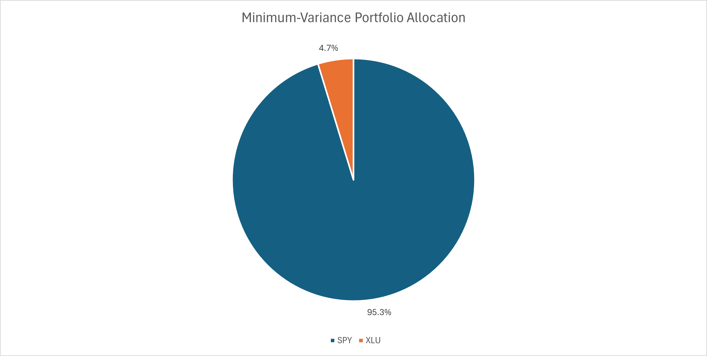

# 📊 SPY vs XLU Portfolio Optimization (2020–2025)

## Executive Summary
This project applies **Mean–Variance Portfolio Optimization (MVO)** to analyze the optimal allocation between **SPY (S&P 500 ETF)** and **XLU (Utilities Select Sector ETF)** using daily historical data from 2020–2025. The analysis evaluates return, volatility, and correlation dynamics to construct an **efficient frontier** and identify the **minimum-variance portfolio**. Results show that incorporating a small defensive allocation to XLU reduces portfolio risk while preserving nearly the full equity return profile of SPY.

---

## Business Problem
Equity-heavy portfolios can deliver strong long-term growth but expose investors to elevated volatility and drawdown risk. This project answers:

**Can diversification into a defensive sector ETF reduce portfolio risk without materially sacrificing returns?**

---

## Key Results
- **Optimal Allocation (Minimum Variance):**
  - SPY: **95.3%**
  - XLU: **4.7%**
- **Annualized Return:** **12.0%**
- **Annualized Volatility:** **16.7%**
- **Sharpe Ratio:** **0.72** (risk-free rate assumed at 0%)
- **SPY–XLU Correlation:** **0.48**

---

## Visual Analysis

### Indexed Growth of $1 Investment

### Minimum-Variance Portfolio Allocation

### Efficient Frontier — SPY / XLU Portfolios

---

## Methodology
- **Data Source:** Daily adjusted closing prices for SPY and XLU (Dec 2020 – Dec 2025), sourced from Yahoo Finance  
- **Return Calculation:** Logarithmic returns ln(Pₜ / Pₜ₋₁)  
- **Risk Modeling:** Annualized volatility using √252 scaling  
- **Optimization Framework:** Mean–Variance Optimization  
- **Solver:** Excel GRG Non-Linear Solver  
- **Objective:** Minimize portfolio variance subject to full investment and non-negative weight constraints  

The efficient frontier was constructed by evaluating expected return and volatility across varying SPY/XLU weight combinations.

---

## Tools Used
- **Microsoft Excel**
  - Return and volatility modeling
  - Correlation and covariance analysis
  - Solver-based portfolio optimization
  - Dashboard visualization

---

## Files in This Repository
📥 **Download the Excel model:**  
[SPY_XLU_Portfolio_Optimization_Web.xlsx](SPY_XLU_Portfolio_Optimization/excel/SPY_XLU_Portfolio_Optimization_Web.xlsx)

**Images:** Exported charts used in this README are located in:  
`SPY_XLU_Portfolio_Optimization/assets/img/`

---

## Key Takeaway
Even a small allocation to a defensive sector ETF can improve portfolio risk efficiency. This project demonstrates how **quantitative portfolio construction techniques** support better asset allocation decisions in real-world investment contexts.

---

## Next Steps
- Extend the model to include additional asset classes (bonds, commodities)
- Incorporate a non-zero risk-free rate
- Perform rolling-window optimization to assess allocation stability
- Rebuild the model in Python for scalability and automation
